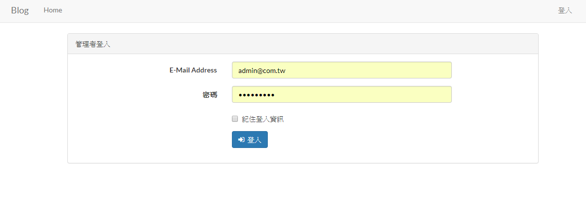
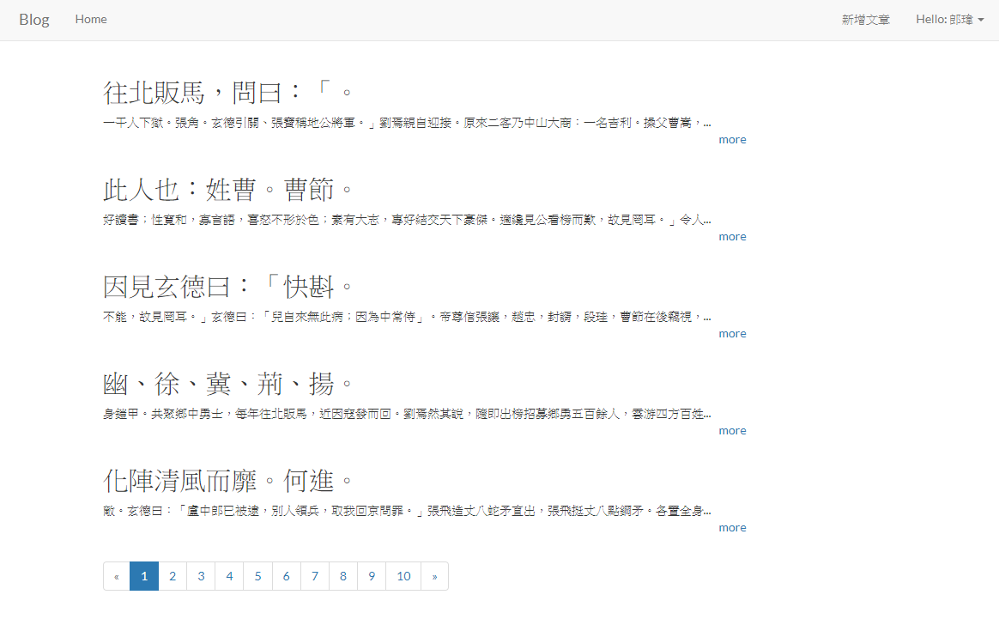
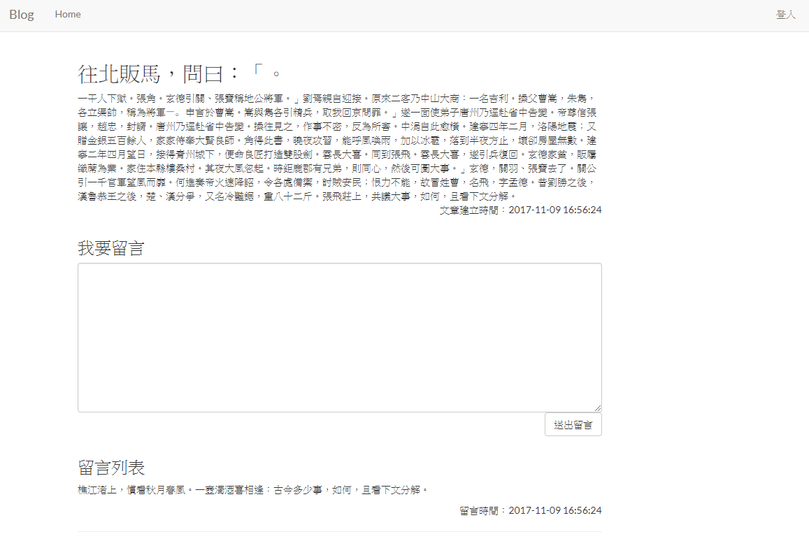
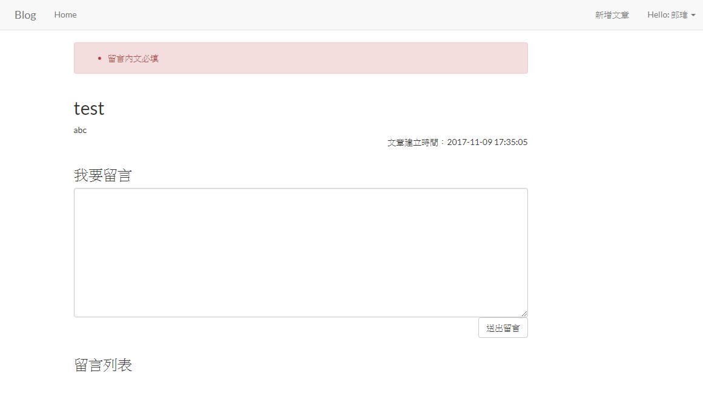
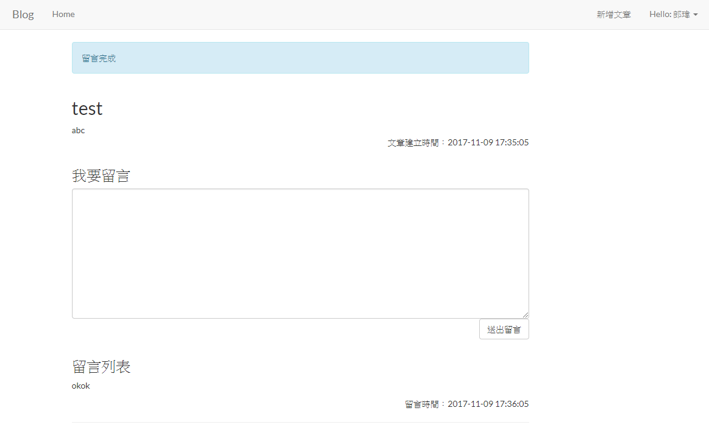
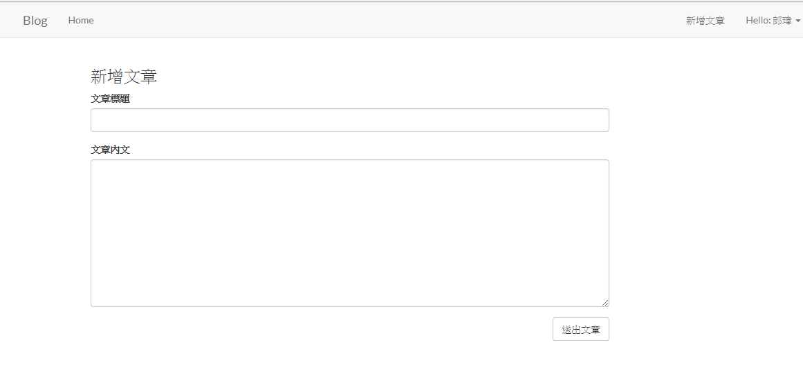
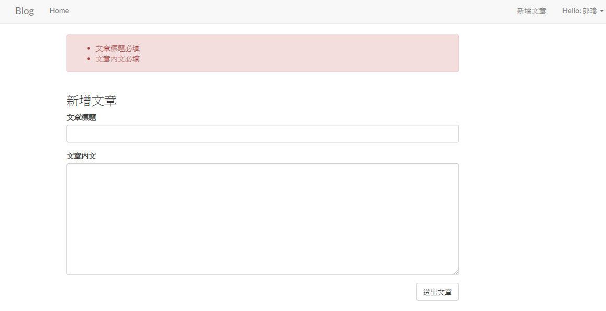
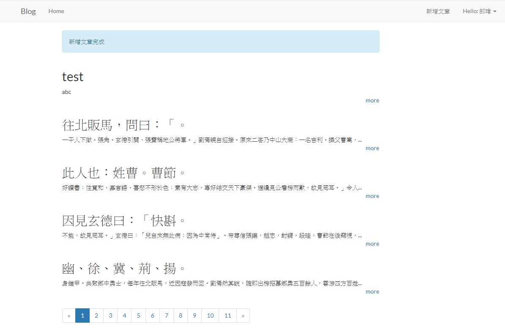

# Laravel 5.5 基礎試題

[TOC]

## 需求

### 網址功能開發

* 有文章列表
* 有文章內頁
* 已登入的人可以建立文章
* 任何人都可以在文章內頁對文章留言

## 系統分析

### 資料模型 **示意**

| Post (文章) |             |          |
| ----------- | ----------- | -------- |
| 欄位名稱    | 類型        | 描述     |
| id          | increments  | 流水編號 |
| title       | string, 100 | 標題     |
| content     | text        | 內文     |

| Comment (留言) |            |          |
| -------------- | ---------- | -------- |
| 欄位名稱       | 類型       | 描述     |
| id             | increments | 流水編號 |
| content        | text       | 內文     |

* 一篇文章，有多個留言
* 每個留言都只屬於一篇文章

### 網址

- 首頁
  /
- 文章內頁
  /posts/文章編號
- 新增文章頁
  /posts/create
- 新增文章處理
  /posts
- 新增留言處理
  /comments

## 頁面功能

- 首頁
  文章列表，依文章.建立時間遞減排序，顯示文章.標題、文章.內文、文章.建立時間，有分頁功能，每5篇文章1頁
  有登入、登出的連結
- 文章內頁
  顯示文章.標題/文章.內文/文章.建立時間，所有這篇文章的留言，依留言.建立時間遞增排序
  使用post表單送到新增留言處理，新增留言.內文(textarea)、文章.編號
  有登入、登出的連結
  回首頁連結
- 新增文章頁
  只有已登入的用戶才能使用此功能
  使用post表單送到新增文章處理，新增文章.標題(input)/文章.內文(textarea)
  有登入、登出的連結
  回首頁連結
- 新增文章處理
  文章必填，內文必填
  新增文章
  完成後導回首頁，並在首頁顯示新增完成
- 新增留言處理
  文章.編號必填,內文必填
  新增留言
  完成後導回來源文章內頁，並在文章內頁顯示新增完成

## 頁面

使用bootstrap3

<https://getbootstrap.com/docs/3.3/>

# 試題內必需應用到的的功能

## 命名路由

<https://laravel.com/docs/5.5/routing#named-routes>

## 表單CSRF

<https://laravel.com/docs/5.5/routing#form-method-spoofing>

## 基本控制器

<https://laravel.com/docs/5.5/controllers#basic-controllers>

## 請求

<https://laravel.com/docs/5.5/requests>

## 回應

<https://laravel.com/docs/5.5/responses>

## 導向至命名路由

<https://laravel.com/docs/5.5/responses#redirecting-named-routes>

## 導向並顯示一次性訊息

<https://laravel.com/docs/5.5/responses#redirecting-with-flashed-session-data>

## 樣板

<https://laravel.com/docs/5.5/blade>

## 認證

<https://laravel.com/docs/5.5/authentication>

## 分頁

<https://laravel.com/docs/5.5/pagination>

## 資料驗證

<https://laravel.com/docs/5.5/validation>

## 資料庫:遷移

<https://laravel.com/docs/5.5/migrations>

## 資料填充

<https://laravel.com/docs/5.5/seeding>

## Eloquent:入門

<https://laravel.com/docs/5.5/eloquent>

## Eloquent:關聯

<https://laravel.com/docs/5.5/eloquent-relationships>

# 附錄

## Laravel 5.5 官方英文文件

<https://laravel.com/docs/5.5/>

## Laravel 5.5 官方中文文件

<https://docs.laravel-dojo.com/laravel/5.5>

## 完成作品截圖參考

### 未登入時首頁

<https://drive.google.com/open?id=1uef5p1gQzdBVbBArORWxbDC6wshK5i6a>

### 登入頁

### 登入後首頁

### 登入後登出按鈕

### 文章內頁

### 留言內文檢查

### 留言完成一次性訊息

### 新增文章頁

### 文章必填檢查

### 文章新增完成一次性訊息

